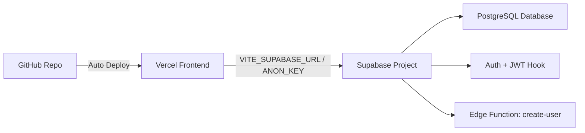

# RegDeck (InvoiceGen) — Deployment Guide

This guide describes how to transfer this codebase to a different GitHub account and deploy it to Vercel with a new Supabase backend.

---

## Architecture Overview



| Component | Technology | Config |
|-----------|-----------|--------|
| Frontend | Vite + React | `.env.prod` → Vercel env vars |
| Database | Supabase PostgreSQL | `supabase_live_setup.sql` |
| Auth | Supabase Auth + Custom JWT Hook | Configured in Supabase Dashboard |
| Edge Function | Deno (Supabase Functions) | `supabase/functions/create-user/` |
| Hosting | Vercel | Auto-deploy from GitHub |

---

## Step 1: Push Code to New GitHub Account

### Option A — Fork (if the source repo is public)
1. Log into the **new** GitHub account in your browser
2. Go to the original repo: `github.com/zestaisolutions/InvoiceGen`
3. Click **Fork** → select the new account as the destination
4. Rename the fork if desired (Settings → Repository name)

### Option B — Fresh Push (private repo or clean start)

```bash
# 1. Clone the current repo locally (if not already)
git clone https://github.com/zestaisolutions/InvoiceGen.git RegDeck
cd RegDeck

# 2. Remove the old remote
git remote remove origin

# 3. Create a NEW empty repo on the new GitHub account (via browser)
#    Name it: RegDeck (or InvoiceGen)
#    DO NOT initialize with README, .gitignore, or license

# 4. Add the new repo as remote
git remote add origin https://github.com/<NEW_GITHUB_USERNAME>/RegDeck.git

# 5. Push all branches and tags
git push -u origin main
git push --tags
```

---

## Step 2: Set Up New Supabase Project

### 2.1 Create a New Supabase Project

1. Go to [supabase.com/dashboard](https://supabase.com/dashboard)
2. Log in with the **new account** (or the same account — just a new project)
3. Click **New Project**
4. Fill in:
   - **Name**: `RegDeck` (or any name)
   - **Database Password**: Generate a strong password and **save it securely**
   - **Region**: Choose the closest to your users
5. Wait for the project to provision (~2 minutes)

### 2.2 Collect Your Credentials

After the project is created, go to **Settings → API** and note down:

| Credential | Where to Find | Used In |
|-----------|--------------|---------|
| **Project URL** | `Settings → API → Project URL` | `.env.prod` as `VITE_SUPABASE_URL` |
| **anon/public key** | `Settings → API → Project API keys → anon` | `.env.prod` as `VITE_SUPABASE_ANON_KEY` |
| **service_role key** | `Settings → API → Project API keys → service_role` | Edge function (auto-injected by Supabase) |
| **Project Ref** | The ID in your project URL (e.g., `abcdefghijkl`) | Supabase CLI linking |

### 2.3 Run the Database Schema

1. Go to **SQL Editor** in the Supabase Dashboard
2. Click **New Query**
3. Copy the entire contents of `supabase_live_setup.sql` and paste it
4. Click **Run** (or press Ctrl+Enter)
5. Verify no errors appear — this creates all tables, seeds reference data, sets up the JWT hook, and applies all RLS policies

### 2.4 Enable the Custom Access Token Hook

1. Go to **Authentication → Hooks** in the Supabase Dashboard
2. Under **Custom Access Token Hook**, click **Enable Hook**
3. Select schema: `public`
4. Select function: `custom_access_token_hook`
5. Click **Save**

### 2.5 Create the First Admin User

Since there's no admin user yet, you need to create one manually:

1. Go to **Authentication → Users** in the Supabase Dashboard
2. Click **Add User → Create New User**
3. Fill in email and password, enable **Auto Confirm**
4. After user is created, copy the user's **UUID**
5. Go to **SQL Editor** and run:

```sql
-- Insert into ref_users (required for work order assignment)
INSERT INTO public.ref_users (name, user_id, is_active)
VALUES ('Admin Name', '<USER_UUID>', true);

-- Assign admin role
INSERT INTO public.user_roles (user_id, role_id)
VALUES (
  '<USER_UUID>',
  (SELECT id FROM public.roles WHERE role_name = 'admin')
);
```

6. **Sign out and back in** to refresh the JWT with the new role

### 2.6 Deploy the Edge Function

```bash
# 1. Install Supabase CLI (if not already)
npm install -g supabase

# 2. Login to Supabase CLI
npx supabase login

# 3. Link to your NEW project
cd RegDeck
npx supabase link --project-ref <YOUR_NEW_PROJECT_REF>

# 4. Deploy the edge function
npx supabase functions deploy create-user --no-verify-jwt
```

---

## Step 3: Deploy to Vercel

### 3.1 Connect GitHub to Vercel

1. Go to [vercel.com](https://vercel.com) and log in with the **new account**
2. Click **Add New → Project**
3. Click **Import Git Repository**
4. If the new GitHub account is not connected yet:
   - Click **Add GitHub Account**
   - Authorize Vercel to access the new GitHub account
   - Select the repository: `RegDeck`
5. Click **Import**

### 3.2 Configure the Project

On the project configuration screen:

| Setting | Value |
|---------|-------|
| **Framework Preset** | Vite |
| **Root Directory** | `./ ` (leave default) |
| **Build Command** | `npm run build:prod` |
| **Output Directory** | `dist` |
| **Install Command** | `npm install` |

### 3.3 Set Environment Variables

Before clicking Deploy, add these environment variables:

| Key | Value | Environment |
|-----|-------|-------------|
| `VITE_SUPABASE_URL` | `https://<YOUR_PROJECT_REF>.supabase.co` | Production |
| `VITE_SUPABASE_ANON_KEY` | Your project's `anon` public key | Production |

### 3.4 Deploy

1. Click **Deploy**
2. Wait for the build to complete (~1-2 minutes)
3. Vercel will provide a production URL like `regdeck.vercel.app`

### 3.5 Configure Custom Domain (Optional)

1. Go to **Settings → Domains** in Vercel
2. Add your custom domain (e.g., `app.regdeck.com`)
3. Follow the DNS configuration instructions (CNAME or A record)
4. SSL is auto-provisioned by Vercel

---

## Step 4: Post-Deployment Configuration

### 4.1 Update Supabase Auth Redirect URLs

1. Go to **Authentication → URL Configuration** in Supabase Dashboard
2. Add your Vercel URL to **Redirect URLs**:
   - `https://regdeck.vercel.app/**`
   - `https://app.regdeck.com/**` (if using custom domain)
3. Set **Site URL** to your production URL:
   - `https://regdeck.vercel.app`

### 4.2 Update Edge Function CORS (if needed)

The current edge function allows all origins (`*`). For production security, you may want to restrict this:

In `supabase/functions/create-user/index.ts`, change:
```ts
// FROM:
"Access-Control-Allow-Origin": "*",

// TO:
"Access-Control-Allow-Origin": "https://regdeck.vercel.app",
```

Then redeploy:
```bash
npx supabase functions deploy create-user --no-verify-jwt
```

---

## Step 5: Verification Checklist

After deployment, verify each feature:

| # | Test | How |
|---|------|-----|
| 1 | **Login** | Sign in with the admin user created in Step 2.5 |
| 2 | **Role check** | Verify admin sidebar links appear (Reports, Manage Users, Manage Rates, Manage Divisions, etc.) |
| 3 | **Create Work Order** | Create a single work order and verify it saves |
| 4 | **Bulk Upload** | Upload a CSV template and verify records are created |
| 5 | **Reports** | Navigate to Reports tab and verify data loads |
| 6 | **Invoice Generation** | Generate an invoice Excel and verify division codes load from DB |
| 7 | **Manage Users** | Create a new user via the Manage Users screen (tests edge function) |
| 8 | **Manage Rates** | Add/edit reference rates |
| 9 | **Manage Divisions** | Add/edit division code mappings |
| 10 | **Profile Settings** | Change password |

---

## Quick Reference — File Map

```
RegDeck/
├── .env.local              # Local dev credentials (NOT committed)
├── .env.prod               # Production credentials (NOT committed)
├── .gitignore              # Excludes .env files
├── package.json            # npm scripts: dev, build, build:prod
├── vite.config.js          # Vite configuration
├── index.html              # Entry HTML
├── src/
│   ├── supabaseClient.js   # Reads VITE_SUPABASE_URL + ANON_KEY from env
│   ├── App.jsx             # Routes
│   ├── main.jsx            # React entry
│   └── pages/              # All page components
├── supabase_live_setup.sql # Complete DB schema + seeds + RLS (run once)
└── supabase/
    ├── config.toml         # Supabase CLI config
    └── functions/
        └── create-user/    # Edge function for user management
            └── index.ts
```

---

## Troubleshooting

| Issue | Cause | Fix |
|-------|-------|-----|
| Login works but no admin features visible | JWT hook not enabled | Enable `custom_access_token_hook` in Auth → Hooks |
| "Missing Supabase environment variables" error | `.env.prod` not configured or Vercel env vars missing | Add `VITE_SUPABASE_URL` and `VITE_SUPABASE_ANON_KEY` to Vercel |
| Edge function 500 error | Function not deployed to new project | Run `npx supabase functions deploy create-user --no-verify-jwt` |
| "infinite recursion in policy" error | Old subquery-based RLS policies exist | Re-run `supabase_live_setup.sql` on a fresh database |
| Division mappings show empty | `division_mappings` table not seeded | Verify the SQL script ran completely (check for partial errors) |
| Build succeeds but app shows blank page | Wrong build output directory in Vercel | Set Output Directory to `dist` in Vercel project settings |
